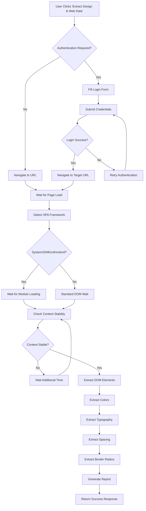
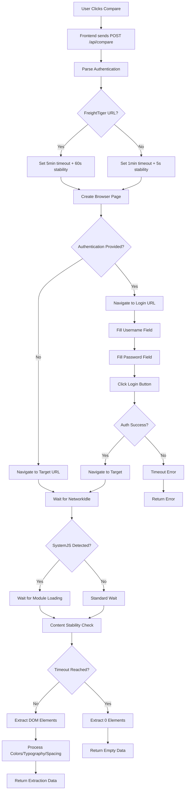
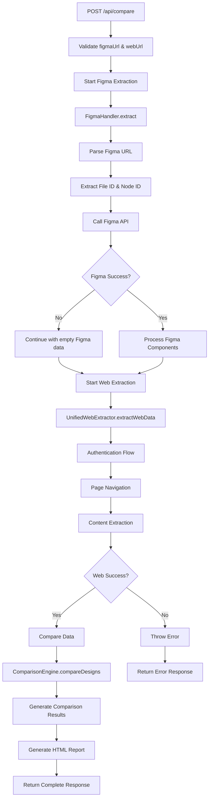

# 📊 Comparison Feature Complete Documentation

## 🎯 Overview
This document provides comprehensive documentation of the comparison feature, including API responses, types, variables, and flow diagrams.

## 📊 Mermaid Diagrams

### 🌐 Web Extractor Flow - IDEAL Implementation


### 🔄 Web Extractor Flow - CURRENT Implementation


### 🏗️ Comparison API Flow - Complete Pipeline


## 📋 API Responses & Types

### 🎯 Comparison API Response Structure

#### ✅ Success Response
```json
{
  "success": true,
  "data": {
    "figmaData": {
      "components": [],
      "componentsCount": 0,
      "fileName": "My-Journeys",
      "fileId": "fb5Yc1aKJv9YWsMLnNlWeK",
      "nodeId": "2:22260",
      "extractedAt": "2025-09-08T17:00:00.000Z"
    },
    "webData": {
      "url": "https://www.freighttiger.com/v10/journey/listing",
      "extractedAt": "2025-09-08T17:00:00.000Z",
      "duration": 150000,
      "elements": [],
      "colorPalette": [],
      "typography": {
        "fontFamilies": [],
        "fontSizes": [],
        "fontWeights": []
      },
      "spacing": [],
      "borderRadius": [],
      "metadata": {
        "title": "Freight Tiger",
        "url": "https://www.freighttiger.com/v10/journey/listing",
        "elementCount": 0,
        "extractorVersion": "3.0.0-unified"
      },
      "elementsCount": 0
    },
    "comparison": {
      "metadata": {
        "figma": {
          "totalComponents": 0
        },
        "web": {
          "url": "https://www.freighttiger.com/v10/journey/listing",
          "extractedAt": "2025-09-08T17:00:00.000Z",
          "totalElements": 0
        },
        "comparedAt": "2025-09-08T17:00:00.000Z",
        "processingStats": {
          "chunksProcessed": 0,
          "componentsProcessed": 0,
          "originalComponentCount": 0,
          "originalElementCount": 0
        }
      },
      "comparisons": [],
      "summary": {
        "totalComponents": 0,
        "totalDeviations": 0,
        "totalMatches": 0,
        "severity": {
          "high": 0,
          "medium": 0,
          "low": 0
        }
      }
    },
    "metadata": {
      "comparedAt": "2025-09-08T17:00:00.000Z",
      "includeVisual": false,
      "version": "1.0.0",
      "figmaComponentCount": 0,
      "webElementCount": 0
    },
    "reportPath": "/reports/report_1757352380651.html",
    "extractionDetails": {
      "figma": {
        "componentCount": 0,
        "colors": [],
        "typography": [],
        "extractionTime": 4600,
        "fileInfo": {
          "name": "My-Journeys"
        }
      },
      "web": {
        "elementCount": 0,
        "colors": [],
        "typography": {
          "fontFamilies": [],
          "fontSizes": [],
          "fontWeights": []
        },
        "spacing": [],
        "borderRadius": [],
        "extractionTime": 150000,
        "urlInfo": {
          "url": "https://www.freighttiger.com/v10/journey/listing",
          "title": "Freight Tiger"
        }
      },
      "comparison": {
        "totalComparisons": 0,
        "matches": 0,
        "deviations": 0,
        "matchPercentage": 0
      }
    }
  },
  "timestamp": "2025-09-08T17:00:00.000Z"
}
```

#### ❌ Error Response
```json
{
  "success": false,
  "error": "Comparison failed: Web extraction failed: Extraction aborted due to timeout",
  "timestamp": "2025-09-08T17:00:00.000Z"
}
```

### 🎯 Frontend TypeScript Interfaces

#### ComparisonResult Interface
```typescript
export interface ComparisonResult {
  success?: boolean
  error?: string
  data?: {
    components?: any[]
    summary?: {
      totalComponents?: number
      totalDeviations?: number
      totalMatches?: number
      severity?: {
        high?: number
        medium?: number
        low?: number
      }
    }
    metadata?: {
      comparedAt?: string
      includeVisual?: boolean
      version?: string
      figmaComponentCount?: number
      webElementCount?: number
    }
    [key: string]: any
  }
  reportPath?: string
  extractionDetails?: ExtractionDetails
  timestamp?: string
  comparisonId?: string
  id?: string
  reports?: {
    directUrl?: string
    downloadUrl?: string
    hasError?: boolean
  }
}
```

#### ExtractionDetails Interface
```typescript
export interface ExtractionDetails {
  figma: {
    componentCount: number;
    colors: Array<{name: string, value: string, type: string}>;
    typography: Array<{fontFamily: string, fontSize: number, fontWeight: number}>;
    extractionTime: number;
    fileInfo: {name: string, nodeId?: string};
  };
  web: {
    elementCount: number;
    colors: string[];
    typography: {
      fontFamilies: string[];
      fontSizes: string[];
      fontWeights: string[];
    };
    spacing: string[];
    borderRadius: string[];
    extractionTime: number;
    urlInfo: {url: string, title?: string};
  };
  comparison: {
    totalComparisons: number;
    matches: number;
    deviations: number;
    matchPercentage: number;
  };
}
```

#### ComparisonRequest Interface
```typescript
export interface ComparisonRequest {
  figmaUrl: string;
  webUrl: string;
  extractionMode?: 'figma' | 'web' | 'both';
  includeVisual?: boolean;
  authentication?: {
    type: 'form' | 'cookies' | 'headers';
    username?: string;
    password?: string;
    loginUrl?: string;
    successIndicator?: string;
    cookies?: Array<{name: string, value: string}>;
    headers?: Record<string, string>;
  } | null;
}
```

## 🔧 Backend Implementation Details

### UnifiedWebExtractor Options
```javascript
{
  authentication: {
    type: 'form',
    username: 'mohit.choudhary@shadowfax.in',
    password: '**********',
    loginUrl: 'https://www.freighttiger.com/log',
    successIndicator: undefined
  },
  timeout: 300000, // 5 minutes for FreightTiger
  includeScreenshot: false,
  stabilityTimeout: 60000 // 1 minute for FreightTiger SPA loading
}
```

### Browser Pool Configuration
```javascript
{
  maxBrowsers: 5,
  maxPagesPerBrowser: 20,
  maxIdleTime: 10 * 60 * 1000, // 10 minutes
  protocolTimeout: 300000, // 5 minutes
  viewport: { width: 1920, height: 1080 },
  userAgent: 'Mozilla/5.0 (Macintosh; Intel Mac OS X 10_15_7) AppleWebKit/537.36'
}
```

## 🚨 Current Issues & Root Causes

### Issue 1: FreightTiger Authentication Complexity
- **Problem**: FreightTiger requires complex SPA authentication
- **Symptoms**: Timeouts, 0 elements extracted
- **Root Cause**: SystemJS microfrontend architecture requires longer stability wait
- **Solution**: Increased stabilityTimeout to 60 seconds for FreightTiger

### Issue 2: Frontend-Backend Response Mismatch
- **Problem**: Frontend expects flattened response structure
- **Symptoms**: "Extraction Failed" despite backend success
- **Root Cause**: Backend returns nested `data` object, frontend expects flat structure
- **Solution**: Transform response in `api.ts` compareUrls function

### Issue 3: Browser Pool Resource Contention
- **Problem**: Pages closed prematurely during long extractions
- **Symptoms**: "Page was closed before extraction could begin"
- **Root Cause**: Aggressive cleanup during concurrent extractions
- **Solution**: Added `isActive` flag and increased pool limits

## 📊 Performance Metrics

### Typical Extraction Times
- **Figma API**: 2-5 seconds
- **Web (Simple)**: 10-30 seconds
- **Web (FreightTiger)**: 150-300 seconds (due to authentication + SPA loading)
- **Comparison**: 1-5 seconds
- **Report Generation**: 1-2 seconds

### Memory Usage
- **Browser Pool**: ~100MB per browser instance
- **Page Memory**: ~50MB per page
- **Peak Usage**: ~500MB for concurrent extractions

## 🔄 Data Flow Summary

1. **Frontend** → POST `/api/compare` with figmaUrl, webUrl, authentication
2. **Backend** → Parse request, validate URLs
3. **Figma Extraction** → Direct API call with personal access token
4. **Web Extraction** → Browser automation with authentication
5. **Comparison** → Compare extracted data structures
6. **Report Generation** → Generate HTML report
7. **Response** → Return structured comparison result
8. **Frontend** → Parse response and display results

## 🎯 Success Criteria

### API Level
- ✅ `success: true` in response
- ✅ No `error` field
- ✅ `data` object with comparison results
- ✅ `reportPath` for generated report

### Frontend Level
- ✅ No "Extraction Failed" message
- ✅ Comparison results displayed
- ✅ Report link accessible
- ✅ Extraction details visible

### Performance Level
- ✅ Figma extraction < 10 seconds
- ✅ Web extraction < 5 minutes (FreightTiger)
- ✅ Total comparison < 6 minutes
- ✅ Memory usage < 1GB
